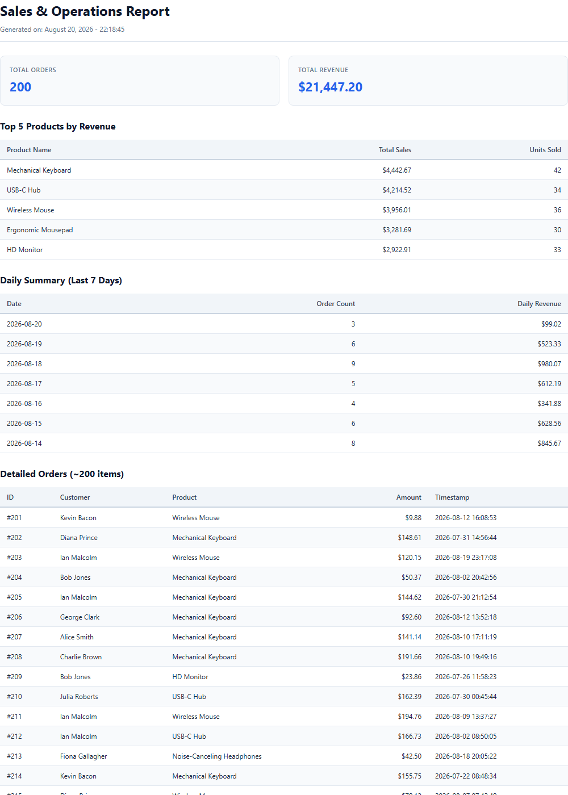

# PDF Report Generator

An automated PDF report generation and serving service built with **FastAPI**, **Playwright (Chromium)**, and **SQLite**. It aggregates raw sales data using SQL queries, formats it into styled HTML with strict print pagination CSS, renders a PDF document via headless Chromium, and serves it using the "Store and Link" pattern.

---

## 🏗️ Architecture Breakdown

The application operates as a 4-stage pipeline:

```
[ SQLite DB ] ──( 1. Query )──> [ Aggregated Metrics ] ──( 2. Render )──> [ Playwright Chromium ] ──( 3. Store )──> [ Disk & DB ] ──( 4. Serve )──> [ Client / REST API ]
```

1. **Query**: Aggregates ~200 order records from `report.db` into summary metrics, top products, daily breakdowns, and itemized rows via optimized SQL queries.
2. **Render**: Injects aggregated data into an HTML template with CSS print rules (`@page`, `thead` repetition, `break-inside: avoid`) for clean page pagination.
3. **Store**: Spawns a headless Chromium browser instance using Playwright, renders the HTML to A4 PDF, saves it to `reports/<id>.pdf`, and records the metadata in the `reports` database table.
4. **Serve**: Exposes REST endpoints to query report metadata or stream PDF files on demand (`GET /reports/{id}/file`).

---

## 🚀 Setup & Run Instructions

### 1. Prerequisites & Installation

```bash
# Clone repository
git clone https://github.com/shahrukhfu/pdf-report-generator.git
cd "PDF Report Generator"

# Install dependencies
pip install fastapi uvicorn playwright pypdf

# Install headless Chromium browser
playwright install chromium
```

### 2. Seed Database

Initialize and seed `report.db` with ~200 randomized sales records:

```bash
python seed.py
```

### 3. Start FastAPI Web Server

```bash
uvicorn main:app --reload
```
The server will run at `http://127.0.0.1:8000`.

---

## 📊 SQL Aggregation Queries

The report data pipeline relies on four main SQLite aggregation queries in `report_data.py`:

* **Total Orders**:
  ```sql
  SELECT COUNT(*) FROM orders;
  ```
* **Total Revenue**:
  ```sql
  SELECT SUM(amount) FROM orders;
  ```
* **Top 5 Products by Revenue**:
  ```sql
  SELECT product, SUM(amount) AS total_sales, COUNT(*) AS count 
  FROM orders 
  GROUP BY product 
  ORDER BY total_sales DESC 
  LIMIT 5;
  ```
* **Daily Orders (Last 7 Days)**:
  ```sql
  SELECT date(created_at) AS day, COUNT(*) AS order_count, SUM(amount) AS daily_revenue 
  FROM orders 
  GROUP BY date(created_at) 
  ORDER BY day DESC 
  LIMIT 7;
  ```

---

## 📡 API Reference & cURL Examples

### 1. Health Check
```bash
curl -X GET http://127.0.0.1:8000/health
```
**Response (200 OK):**
```json
{"status": "ok"}
```

### 2. Generate PDF Report (POST /reports)

* **Standard Request (Deduplicated):**
  ```bash
  curl -X POST http://127.0.0.1:8000/reports
  ```
  *Returns existing report created today with `200 OK` if available, or `201 Created` if creating a new one.*

* **Force Generation:**
  ```bash
  curl -X POST http://127.0.0.1:8000/reports \
    -H "Content-Type: application/json" \
    -d '{"force": true}'
  ```

**Response (201 Created / 200 OK):**
```json
{
  "id": 1,
  "file": "/reports/1/file",
  "created_at": "2026-08-20 22:16:21"
}
```

### 3. Get Report Metadata (GET /reports/{id})
```bash
curl -X GET http://127.0.0.1:8000/reports/1
```
**Response (200 OK):**
```json
{
  "id": 1,
  "path": "reports/1.pdf",
  "file": "/reports/1/file",
  "created_at": "2026-08-20 22:16:21"
}
```

### 4. Download PDF Report File (GET /reports/{id}/file)
```bash
curl -X GET http://127.0.0.1:8000/reports/1/file --output report_download.pdf
```

---

## 🧠 Architectural & Performance Analysis

1. **Synchronous PDF Rendering & Worker Queue Transition**:
   Generating PDFs synchronously inside an HTTP request handler introduces significant latency (often 500ms–2000ms+) because launching a headless browser process and rendering a multi-page document is CPU- and memory-intensive; under high concurrency, this saturates server worker threads and degrades throughput. To prevent request timeouts and server exhaustion, PDF generation should be offloaded to an asynchronous background task queue (such as Celery, Redis Queue, or ARQ), allowing web endpoints to return a fast `202 Accepted` response while background workers process the jobs.

2. **Idempotency & Cost/Storage Efficiency**:
   Implementing idempotent report generation ensures that repeated requests for the same daily period return a cached, pre-rendered PDF link rather than spawning browser subprocesses and generating redundant files. This deduplication saves substantial CPU compute cycles, reduces disk I/O load, and avoids cluttering storage with identical binary report files.

---

## 📄 Generated Report Preview

Below is a preview of Page 1 of the generated PDF report:


